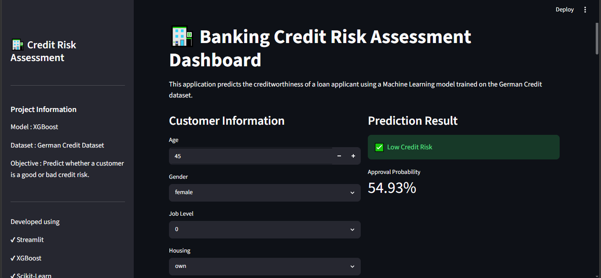

# 🏦 Credit Risk Assessment using Machine Learning

## 📌 Project Overview

This project is an end-to-end **Credit Risk Classification System** designed to predict the creditworthiness of loan applicants using Machine Learning techniques.

It analyzes applicant financial and demographic attributes such as age, job_status, housing type, savings behavior, credit history, loan amount, and loan purpose to classify individuals as:

- ✅ Good Credit Risk  
- ❌ Bad Credit Risk  

The project demonstrates a complete **data science pipeline applied to financial risk modeling**, including model development, evaluation, comparison, and deployment.

---

## 🎯 Objectives

- Develop a predictive model for credit risk classification
- Compare multiple machine learning algorithms for performance benchmarking
- Select an optimal model based on evaluation metrics
- Deploy an interactive web application for real-time predictions
- Simulate a real-world financial risk assessment system used in banking and lending institutions

---

## 📊 Dataset

**Dataset:** German Credit Dataset  

This dataset contains financial and personal attributes of loan applicants used for credit risk evaluation.

### Key Features:
- Age
- Sex
- Job
- Housing
- Saving Accounts
- Checking Account
- Credit Amount
- Loan Duration
- Loan Purpose
- Risk (Target Variable)

---

## 🔍 Exploratory Data Analysis (EDA)

Comprehensive EDA was performed to understand patterns affecting credit risk:

- Age distribution across risk categories  
- Savings behavior vs credit risk  
- Credit amount vs housing type  
- Correlation heatmap analysis  
- Loan purpose impact on risk classification  
- Feature importance using XGBoost  

These insights helped identify key drivers of creditworthiness.

---

## ⚙️ Data Preprocessing

To ensure model reliability and performance, the following preprocessing steps were applied:

- Handling missing values  
- Label encoding for categorical variables  
- Feature scaling using StandardScaler  
- Train-test split (80:20)  
- Saving preprocessing objects using Joblib  

### Saved Artifacts:
- `scaler.pkl`  
- `label_encoders.pkl`  

---

## 🤖 Machine Learning Models

Three models were trained and evaluated to identify the best-performing approach:

| Model            | Accuracy |
|------------------|----------|
| Neural Network   | 73.5%    |
| Random Forest    | 75.5%    |
| XGBoost          | **77.5%** |

---

## 🏆 Final Model Selection

### ✔ XGBoost Classifier

XGBoost was selected as the final model due to:

- Highest predictive accuracy  
- Strong generalization performance  
- Robust handling of structured financial data  
- Better balance between bias and variance  

This makes it well-suited for **financial risk prediction problems**, where accuracy and stability are critical.

---

## 💻 Streamlit Web Application

The project is deployed using **Streamlit**, enabling an interactive user experience.

### Key Features:

- Customer input form for loan application data  
- Real-time credit risk prediction  
- Probability score visualization  
- Risk classification (Low / Medium / High)  
- Enhanced due diligence recommendations  
- Model comparison dashboard  
- Feature importance visualization (XGBoost)  

---

## 📁 Project Structure

```bash
credit_risk_assessment_project/

├── app/
│   ├── app.py
│   └── utils.py
│
├── data/
├── evaluation/
├── images/
├── models/
├── notebooks/
├── saved_models/
│
├── main.py
├── requirements.txt
└── README.md


## 🛠️ Technologies Used

* Python
* Pandas
* NumPy
* Matplotlib
* Seaborn
* Scikit-learn
* XGBoost
* TensorFlow / Keras
* Streamlit
* Joblib

---


```md
## 📈 Results & Impact

- Built an end-to-end machine learning system for credit risk assessment  
- Successfully benchmarked multiple machine learning models  
- Achieved best performance using XGBoost classifier  
- Deployed an interactive decision-support system using Streamlit  

This project demonstrates practical application of machine learning in financial risk analytics and credit decision systems.

---

## 🔮 Future Improvements
Hyperparameter tuning using Optuna / GridSearch
Explainable AI using SHAP for model interpretability
Integration with real-time financial APIs
User authentication for enterprise-grade deployment
Cloud deployment with CI/CD pipeline (AWS / Render / Azure)

---

## 📄 License

This project is created for educational and portfolio purposes.

---

## 👤 Author

**Arshiya Arif Sayyed**  
B.Tech Artificial Intelligence and Data Science  

### Interests:
- Data Science  
- Machine Learning  
- Financial Analytics  
- Artificial Intelligence  

## 📷 Project Screenshots

### Dashboard



### Enhanced Due Diligence Analysis


### Prediction Probability


### Model Comparison


### Feature Importance


